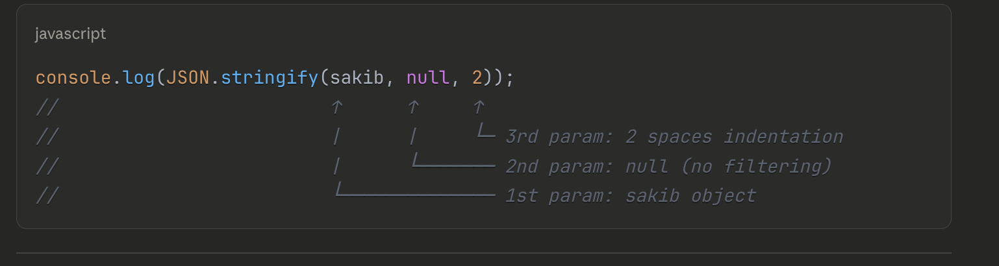

# Inheritance

```javascript
class Cricketer {
  #name;
  #age;
  #centuries;

  constructor(name, age, centuries) {
    this.#name = name;
    this.#age = age;
    this.#centuries = centuries;
  }

  getPlayerDetails() {
    return `${this.#name} is ${this.#age} years old`;
  }
}

class Footballer {
  #name;
  #age;
  #goals;

  constructor(name, age, goals) {
    this.#name = name;
    this.#age = age;
    this.#goals = goals;
  }

  getPlayerDetails() {
    return `${this.#name} is ${this.#age} years old`;
  }
}
```

---

```javascript
class Player {
  #name;
  #age;

  constructor(name, age) {
    this.#name = name;
    this.#age = age;
  }

  getPlayerDetails() {
    return `${this.#name} is ${this.#age} years old`;
  }
}
class Cricketer extends Player {
  #centuries;

  constructor(name, age, centuries) {
    super(name, age);
    this.#centuries = centuries;
  }
}

class Footballer extends Player {
  #goals;

  constructor(name, age, goals) {
    super(name, age);
    this.#goals = goals;
  }
}

const sakib = new Cricketer("Sakib Al Hasan", 36, 20);
console.log(sakib);
```

```bash
Cricketer {}
```

**Your code will work, but when you console.log(sakib), you'll see an empty object {} because private fields are not shown in console output.**

# Private Fields in JavaScript Classes

## The Issue with console.log()

When you use private fields (with `#` prefix) in JavaScript classes, **`console.log()` shows an empty object** even though the data exists.

```javascript
class Player {
  #name;
  #age;

  constructor(name, age) {
    this.#name = name;
    this.#age = age;
  }

  getPlayerDetails() {
    return `${this.#name} is ${this.#age} years old`;
  }
}

class Cricketer extends Player {
  #centuries;

  constructor(name, age, centuries) {
    super(name, age);
    this.#centuries = centuries;
  }
}

const sakib = new Cricketer("Sakib Al Hasan", 36, 20);
console.log(sakib);
// Output: Cricketer {}  ← Looks empty!
```

---

## Why This Happens

**Private fields are truly private** and hidden from external inspection, including `console.log()`.

- ✅ Data exists and works correctly
- ❌ Just not visible in console output
- 🔒 This is by design - privacy is enforced

---

## Solutions

### Solution 1: Use Public Methods

```javascript
class Player {
  #name;
  #age;

  constructor(name, age) {
    this.#name = name;
    this.#age = age;
  }

  getPlayerDetails() {
    return `${this.#name} is ${this.#age} years old`;
  }
}

class Cricketer extends Player {
  #centuries;

  constructor(name, age, centuries) {
    super(name, age);
    this.#centuries = centuries;
  }

  getCricketerDetails() {
    return `${this.name} has scored ${this.#centuries} centuries`;
  }
}

const sakib = new Cricketer("Sakib Al Hasan", 36, 20);
console.log(sakib.getPlayerDetails()); // ✅ "Sakib Al Hasan is 36 years old"
console.log(sakib.getCricketerDetails()); // ✅ Shows centuries
```

---

### Solution 2: Add Getters

```javascript
class Player {
  #name;
  #age;

  constructor(name, age) {
    this.#name = name;
    this.#age = age;
  }

  getPlayerDetails() {
    return `${this.#name} is ${this.#age} years old`;
  }

  // Add getters for controlled access
  get name() {
    return this.#name;
  }

  get age() {
    return this.#age;
  }
}

class Cricketer extends Player {
  #centuries;

  constructor(name, age, centuries) {
    super(name, age);
    this.#centuries = centuries;
  }

  get centuries() {
    return this.#centuries;
  }
}

const sakib = new Cricketer("Sakib Al Hasan", 36, 20);
console.log(sakib); // Still shows Cricketer {}
console.log(sakib.name); // ✅ "Sakib Al Hasan"
console.log(sakib.age); // ✅ 36
console.log(sakib.centuries); // ✅ 20
```

---

### Solution 3: Add toJSON() Method

```javascript
class Player {
  #name;
  #age;

  constructor(name, age) {
    this.#name = name;
    this.#age = age;
  }

  getPlayerDetails() {
    return `${this.#name} is ${this.#age} years old`;
  }

  toJSON() {
    return {
      name: this.#name,
      age: this.#age,
    };
  }
}

class Cricketer extends Player {
  #centuries;

  constructor(name, age, centuries) {
    super(name, age);
    this.#centuries = centuries;
  }

  toJSON() {
    return {
      ...super.toJSON(),
      centuries: this.#centuries,
    };
  }
}

const sakib = new Cricketer("Sakib Al Hasan", 36, 20);
console.log(JSON.stringify(sakib, null, 2));
// ✅ Output:
// {
//   "name": "Sakib Al Hasan",
//   "age": 36,
//   "centuries": 20
// }
```



---

### Solution 4: toString() Method

```javascript
class Player {
  #name;
  #age;

  constructor(name, age) {
    this.#name = name;
    this.#age = age;
  }

  toString() {
    return `Player: ${this.#name}, Age: ${this.#age}`;
  }
}

class Cricketer extends Player {
  #centuries;

  constructor(name, age, centuries) {
    super(name, age);
    this.#centuries = centuries;
  }

  toString() {
    return `${super.toString()}, Centuries: ${this.#centuries}`;
  }
}

const sakib = new Cricketer("Sakib Al Hasan", 36, 20);
console.log(sakib.toString());
// ✅ "Player: Sakib Al Hasan, Age: 36, Centuries: 20"

console.log(String(sakib));
// ✅ Same output
```

---

## Complete Working Example

```javascript
class Player {
  #name;
  #age;

  constructor(name, age) {
    this.#name = name;
    this.#age = age;
  }

  getPlayerDetails() {
    return `${this.#name} is ${this.#age} years old`;
  }

  get name() {
    return this.#name;
  }

  get age() {
    return this.#age;
  }

  toString() {
    return `${this.#name} (${this.#age})`;
  }
}

class Cricketer extends Player {
  #centuries;

  constructor(name, age, centuries) {
    super(name, age);
    this.#centuries = centuries;
  }

  get centuries() {
    return this.#centuries;
  }

  getCricketerDetails() {
    return `${this.name} has scored ${this.#centuries} centuries`;
  }

  toString() {
    return `${super.toString()} - ${this.#centuries} centuries`;
  }
}

class Footballer extends Player {
  #goals;

  constructor(name, age, goals) {
    super(name, age);
    this.#goals = goals;
  }

  get goals() {
    return this.#goals;
  }

  getFootballerDetails() {
    return `${this.name} has scored ${this.#goals} goals`;
  }

  toString() {
    return `${super.toString()} - ${this.#goals} goals`;
  }
}

// Usage
const sakib = new Cricketer("Sakib Al Hasan", 36, 20);
const messi = new Footballer("Lionel Messi", 37, 850);

console.log(sakib.getPlayerDetails()); // "Sakib Al Hasan is 36 years old"
console.log(sakib.getCricketerDetails()); // "Sakib Al Hasan has scored 20 centuries"
console.log(sakib.toString()); // "Sakib Al Hasan (36) - 20 centuries"

console.log(messi.getPlayerDetails()); // "Lionel Messi is 37 years old"
console.log(messi.getFootballerDetails()); // "Lionel Messi has scored 850 goals"
console.log(messi.toString()); // "Lionel Messi (37) - 850 goals"

// Access via getters
console.log(sakib.name); // "Sakib Al Hasan"
console.log(sakib.age); // 36
console.log(sakib.centuries); // 20
console.log(messi.goals); // 850
```

---

## Private vs Public Fields

### Public Fields (Visible)

```javascript
class PlayerPublic {
  name;
  age;

  constructor(name, age) {
    this.name = name;
    this.age = age;
  }
}

const player1 = new PlayerPublic("Alice", 25);
console.log(player1);
// ✅ PlayerPublic { name: 'Alice', age: 25 }
```

### Private Fields (Hidden)

```javascript
class PlayerPrivate {
  #name;
  #age;

  constructor(name, age) {
    this.#name = name;
    this.#age = age;
  }
}

const player2 = new PlayerPrivate("Bob", 30);
console.log(player2);
// ❌ PlayerPrivate {} (looks empty, but data exists)
```

---

## Debugging Private Fields

### In Browser

```javascript
const sakib = new Cricketer("Sakib Al Hasan", 36, 20);

// Use console.dir() in browser dev tools
console.dir(sakib); // Expand in console to see private fields
```

### In Node.js

```javascript
const util = require("util");

const sakib = new Cricketer("Sakib Al Hasan", 36, 20);
console.log(util.inspect(sakib, { showHidden: true }));
```

---

## Comparison Table

| Action                                | Result                   |
| ------------------------------------- | ------------------------ |
| `console.log(sakib)`                  | `Cricketer {}` (empty)   |
| `sakib.#name`                         | ❌ SyntaxError (private) |
| `sakib.name` (without getter)         | ❌ undefined             |
| `sakib.name` (with getter)            | ✅ Works                 |
| `sakib.getPlayerDetails()`            | ✅ Works                 |
| `sakib.toString()`                    | ✅ Works                 |
| `JSON.stringify(sakib)` (with toJSON) | ✅ Works                 |
| `console.dir(sakib)` in browser       | ✅ Shows private fields  |

---

## Best Practices

1. **Add Getters** for read-only access to private fields
2. **Add Public Methods** to expose functionality
3. **Add toString()** for easy debugging
4. **Add toJSON()** for serialization
5. **Don't worry** about `console.log()` showing empty - your data is safe and working!

---

## Key Takeaways

- ✅ Private fields work correctly even if `console.log()` shows empty
- ✅ Use **getters** or **public methods** to access private data
- ✅ Privacy is **by design** - it's a feature, not a bug
- ✅ Add **toString()** or **toJSON()** for better debugging
- 🔒 Private fields are **truly private** and hidden from external access

**Your code works fine!** Private fields are just hidden from console output. 🎯

# Inheritance in JavaScript - Complete Guide

## Table of Contents

- [What is Inheritance?](#what-is-inheritance)
- [Why Use Inheritance?](#why-use-inheritance)
- [Basic Inheritance Syntax](#basic-inheritance-syntax)
- [The `extends` Keyword](#the-extends-keyword)
- [The `super` Keyword](#the-super-keyword)
- [Method Overriding](#method-overriding)
- [Property Inheritance](#property-inheritance)
- [Multi-Level Inheritance](#multi-level-inheritance)
- [The Prototype Chain](#the-prototype-chain)
- [Static Methods and Inheritance](#static-methods-and-inheritance)
- [Private Fields and Inheritance](#private-fields-and-inheritance)
- [Real-World Examples](#real-world-examples)
- [Best Practices](#best-practices)
- [Common Mistakes](#common-mistakes)
- [Inheritance vs Composition](#inheritance-vs-composition)
- [Summary](#summary)

---

## What is Inheritance?

**Inheritance** is one of the four fundamental principles of Object-Oriented Programming (OOP). It allows a class (child/derived class) to **inherit properties and methods** from another class (parent/base class).

### Simple Analogy

Think of **genetics**:

- **Parent** has traits: eye color, height, hair color
- **Child** inherits these traits from parent
- **Child** can also have unique traits

```javascript
// Parent class
class Animal {
  eat() {
    console.log("Eating...");
  }
}

// Child class inherits from Animal
class Dog extends Animal {
  bark() {
    console.log("Woof!");
  }
}

const dog = new Dog();
dog.eat(); // ✅ Inherited from Animal
dog.bark(); // ✅ Own method
```

---

## Why Use Inheritance?

### 1. **Code Reusability**

Write common functionality once in parent class

```javascript
// ❌ Without inheritance - repetitive
class Dog {
  eat() {
    console.log("Eating...");
  }
  sleep() {
    console.log("Sleeping...");
  }
  bark() {
    console.log("Woof!");
  }
}

class Cat {
  eat() {
    console.log("Eating...");
  } // Duplicate!
  sleep() {
    console.log("Sleeping...");
  } // Duplicate!
  meow() {
    console.log("Meow!");
  }
}

// ✅ With inheritance - DRY (Don't Repeat Yourself)
class Animal {
  eat() {
    console.log("Eating...");
  }
  sleep() {
    console.log("Sleeping...");
  }
}

class Dog extends Animal {
  bark() {
    console.log("Woof!");
  }
}

class Cat extends Animal {
  meow() {
    console.log("Meow!");
  }
}
```

### 2. **Hierarchical Classification**

Model real-world relationships

```javascript
// Vehicle (general)
//   ↓
// Car (more specific)
//   ↓
// ElectricCar (even more specific)
```

### 3. **Maintainability**

Change common behavior in one place

```javascript
class Animal {
  eat() {
    console.log("Eating...");
    // If you change this, all child classes get the update
  }
}
```

### 4. **Polymorphism**

Different classes can share the same interface

```javascript
const animals = [new Dog(), new Cat(), new Bird()];
animals.forEach((animal) => animal.eat()); // All have eat()
```

---

## Basic Inheritance Syntax

### Parent Class (Base Class / Superclass)

```javascript
class Animal {
  constructor(name) {
    this.name = name;
  }

  speak() {
    console.log(`${this.name} makes a sound`);
  }
}
```

### Child Class (Derived Class / Subclass)

```javascript
class Dog extends Animal {
  bark() {
    console.log(`${this.name} barks: Woof!`);
  }
}

const dog = new Dog("Buddy");
dog.speak(); // "Buddy makes a sound" (inherited)
dog.bark(); // "Buddy barks: Woof!" (own method)
```

---

## The `extends` Keyword

The `extends` keyword creates an inheritance relationship.

### Syntax

```javascript
class ChildClass extends ParentClass {
  // Child class body
}
```

### What `extends` Does

1. **Inherits all methods** from parent
2. **Inherits all properties** from parent
3. **Sets up prototype chain**
4. **Allows method overriding**

### Example

```javascript
class Vehicle {
  constructor(brand) {
    this.brand = brand;
  }

  start() {
    console.log(`${this.brand} is starting...`);
  }
}

class Car extends Vehicle {
  constructor(brand, model) {
    super(brand); // Call parent constructor
    this.model = model;
  }

  drive() {
    console.log(`${this.brand} ${this.model} is driving`);
  }
}

const car = new Car("Toyota", "Camry");
car.start(); // ✅ Inherited from Vehicle
car.drive(); // ✅ Own method
```

---

## The `super` Keyword

`super` is used to call methods on the parent class.

### 1. Calling Parent Constructor

**MUST** call `super()` in child constructor before using `this`.

```javascript
class Animal {
  constructor(name) {
    this.name = name;
  }
}

class Dog extends Animal {
  constructor(name, breed) {
    super(name); // ✅ Call parent constructor FIRST
    this.breed = breed;
  }
}

const dog = new Dog("Max", "Golden Retriever");
console.log(dog.name); // "Max" (from parent)
console.log(dog.breed); // "Golden Retriever" (from child)
```

### 2. Calling Parent Methods

```javascript
class Animal {
  speak() {
    return "Some sound";
  }
}

class Dog extends Animal {
  speak() {
    const parentSound = super.speak(); // Call parent method
    return `${parentSound} - Woof!`;
  }
}

const dog = new Dog();
console.log(dog.speak()); // "Some sound - Woof!"
```

### 3. Accessing Parent Properties

```javascript
class Rectangle {
  constructor(width, height) {
    this.width = width;
    this.height = height;
  }

  get area() {
    return this.width * this.height;
  }
}

class Square extends Rectangle {
  constructor(side) {
    super(side, side); // Pass same value for width and height
  }

  get perimeter() {
    return 4 * this.width; // Access parent's property
  }
}

const square = new Square(5);
console.log(square.area); // 25 (inherited)
console.log(square.perimeter); // 20 (own method)
```

---

## Method Overriding

Child class can **override** (replace) parent's methods.

### Basic Override

```javascript
class Animal {
  speak() {
    return "Generic animal sound";
  }
}

class Dog extends Animal {
  speak() {
    // Override parent method
    return "Woof!";
  }
}

class Cat extends Animal {
  speak() {
    // Override parent method
    return "Meow!";
  }
}

const dog = new Dog();
const cat = new Cat();

console.log(dog.speak()); // "Woof!" (overridden)
console.log(cat.speak()); // "Meow!" (overridden)
```

### Override with Enhancement

Use `super` to extend parent behavior:

```javascript
class Vehicle {
  start() {
    console.log("Engine starting...");
  }
}

class ElectricCar extends Vehicle {
  start() {
    super.start(); // Call parent method first
    console.log("Electric motor activated");
  }
}

const tesla = new ElectricCar();
tesla.start();
// Output:
// "Engine starting..."
// "Electric motor activated"
```

### Conditional Override

```javascript
class Logger {
  log(message) {
    console.log(message);
  }
}

class DebugLogger extends Logger {
  constructor(debugMode) {
    super();
    this.debugMode = debugMode;
  }

  log(message) {
    if (this.debugMode) {
      super.log(`[DEBUG] ${message}`);
    } else {
      super.log(message);
    }
  }
}

const logger = new DebugLogger(true);
logger.log("Test"); // "[DEBUG] Test"
```

---

## Property Inheritance

### Inherited Properties

```javascript
class Person {
  constructor(name, age) {
    this.name = name;
    this.age = age;
  }
}

class Student extends Person {
  constructor(name, age, grade) {
    super(name, age); // Inherit name and age
    this.grade = grade;
  }
}

const student = new Student("Alice", 20, "A");
console.log(student.name); // "Alice" (inherited)
console.log(student.age); // 20 (inherited)
console.log(student.grade); // "A" (own property)
```

### Adding Properties in Child

```javascript
class Vehicle {
  constructor(brand) {
    this.brand = brand;
    this.wheels = 4;
  }
}

class Motorcycle extends Vehicle {
  constructor(brand, type) {
    super(brand);
    this.wheels = 2; // Override parent property
    this.type = type; // Add new property
  }
}

const bike = new Motorcycle("Harley", "Cruiser");
console.log(bike.brand); // "Harley" (inherited)
console.log(bike.wheels); // 2 (overridden)
console.log(bike.type); // "Cruiser" (added)
```

---

## Multi-Level Inheritance

A child class can inherit from another child class (grandparent → parent → child).

```javascript
class LivingBeing {
  constructor(name) {
    this.name = name;
  }

  breathe() {
    console.log(`${this.name} is breathing`);
  }
}

class Animal extends LivingBeing {
  constructor(name, species) {
    super(name);
    this.species = species;
  }

  move() {
    console.log(`${this.name} is moving`);
  }
}

class Dog extends Animal {
  constructor(name, breed) {
    super(name, "Dog");
    this.breed = breed;
  }

  bark() {
    console.log(`${this.name} is barking`);
  }
}

const dog = new Dog("Max", "Labrador");

dog.breathe(); // ✅ From LivingBeing (grandparent)
dog.move(); // ✅ From Animal (parent)
dog.bark(); // ✅ From Dog (own method)

console.log(dog.name); // "Max" (from LivingBeing)
console.log(dog.species); // "Dog" (from Animal)
console.log(dog.breed); // "Labrador" (from Dog)
```

### Visual Hierarchy

```
LivingBeing
    ↓ (extends)
  Animal
    ↓ (extends)
   Dog

Dog inherits from:
- Animal (parent)
- LivingBeing (grandparent)
```

---

## The Prototype Chain

JavaScript uses **prototype-based inheritance** under the hood.

### How It Works

```javascript
class Animal {
  eat() {
    console.log("Eating...");
  }
}

class Dog extends Animal {
  bark() {
    console.log("Woof!");
  }
}

const dog = new Dog();

// Prototype chain:
// dog → Dog.prototype → Animal.prototype → Object.prototype → null
```

### Checking the Chain

```javascript
console.log(dog instanceof Dog); // true
console.log(dog instanceof Animal); // true
console.log(dog instanceof Object); // true

console.log(Dog.prototype instanceof Animal); // true
```

### Accessing Prototype

```javascript
console.log(Object.getPrototypeOf(dog) === Dog.prototype); // true
console.log(Object.getPrototypeOf(Dog.prototype) === Animal.prototype); // true
```

---

## Static Methods and Inheritance

Static methods are also inherited!

```javascript
class Animal {
  static kingdom() {
    return "Animalia";
  }

  static compare(a, b) {
    return a.age - b.age;
  }
}

class Dog extends Animal {
  constructor(name, age) {
    super();
    this.name = name;
    this.age = age;
  }

  static breed() {
    return "Various breeds";
  }
}

// Inherited static method
console.log(Dog.kingdom()); // "Animalia" (inherited)

// Own static method
console.log(Dog.breed()); // "Various breeds"

// Using inherited static method
const dog1 = new Dog("Max", 5);
const dog2 = new Dog("Bella", 3);
console.log(Dog.compare(dog1, dog2)); // 2
```

---

## Private Fields and Inheritance

Private fields (`#`) are **NOT inherited** - they're truly private to the class.

```javascript
class BankAccount {
  #balance = 0; // Private field

  constructor(initialBalance) {
    this.#balance = initialBalance;
  }

  getBalance() {
    return this.#balance;
  }

  deposit(amount) {
    this.#balance += amount;
  }
}

class SavingsAccount extends BankAccount {
  #interestRate; // Child's own private field

  constructor(initialBalance, rate) {
    super(initialBalance);
    this.#interestRate = rate;
  }

  addInterest() {
    // ❌ Can't access parent's #balance directly
    // this.#balance += this.#balance * this.#interestRate;

    // ✅ Must use parent's public method
    const balance = this.getBalance();
    this.deposit(balance * this.#interestRate);
  }
}

const savings = new SavingsAccount(1000, 0.05);
savings.addInterest();
console.log(savings.getBalance()); // 1050
```

---

## Real-World Examples

### Example 1: Employee Management System

```javascript
class Person {
  constructor(name, age, email) {
    this.name = name;
    this.age = age;
    this.email = email;
  }

  getInfo() {
    return `${this.name}, ${this.age} years old`;
  }

  contact() {
    return `Email: ${this.email}`;
  }
}

class Employee extends Person {
  constructor(name, age, email, employeeId, salary) {
    super(name, age, email);
    this.employeeId = employeeId;
    this.salary = salary;
  }

  getInfo() {
    return `${super.getInfo()}, ID: ${this.employeeId}`;
  }

  getAnnualSalary() {
    return this.salary * 12;
  }
}

class Manager extends Employee {
  constructor(name, age, email, employeeId, salary, department) {
    super(name, age, email, employeeId, salary);
    this.department = department;
    this.team = [];
  }

  addTeamMember(employee) {
    this.team.push(employee);
  }

  getInfo() {
    return `${super.getInfo()}, Department: ${this.department}`;
  }

  getTeamSize() {
    return this.team.length;
  }
}

// Usage
const emp = new Employee("Alice", 30, "alice@example.com", "E001", 5000);
const mgr = new Manager(
  "Bob",
  40,
  "bob@example.com",
  "M001",
  8000,
  "Engineering"
);

console.log(emp.getInfo());
// "Alice, 30 years old, ID: E001"

console.log(mgr.getInfo());
// "Bob, 40 years old, ID: M001, Department: Engineering"

mgr.addTeamMember(emp);
console.log(mgr.getTeamSize()); // 1
```

### Example 2: Shape Hierarchy

```javascript
class Shape {
  constructor(color) {
    this.color = color;
  }

  getColor() {
    return this.color;
  }

  // Abstract method - to be overridden
  getArea() {
    throw new Error("getArea() must be implemented");
  }

  getPerimeter() {
    throw new Error("getPerimeter() must be implemented");
  }
}

class Rectangle extends Shape {
  constructor(color, width, height) {
    super(color);
    this.width = width;
    this.height = height;
  }

  getArea() {
    return this.width * this.height;
  }

  getPerimeter() {
    return 2 * (this.width + this.height);
  }
}

class Circle extends Shape {
  constructor(color, radius) {
    super(color);
    this.radius = radius;
  }

  getArea() {
    return Math.PI * this.radius ** 2;
  }

  getPerimeter() {
    return 2 * Math.PI * this.radius;
  }
}

class Square extends Rectangle {
  constructor(color, side) {
    super(color, side, side);
  }
}

// Usage
const shapes = [
  new Rectangle("red", 10, 5),
  new Circle("blue", 7),
  new Square("green", 4),
];

shapes.forEach((shape) => {
  console.log(
    `${shape.getColor()} shape - Area: ${shape.getArea().toFixed(2)}`
  );
});
// "red shape - Area: 50.00"
// "blue shape - Area: 153.94"
// "green shape - Area: 16.00"
```

### Example 3: Game Character System

```javascript
class Character {
  constructor(name, health, level) {
    this.name = name;
    this.health = health;
    this.maxHealth = health;
    this.level = level;
  }

  takeDamage(damage) {
    this.health = Math.max(0, this.health - damage);
    console.log(
      `${this.name} took ${damage} damage. Health: ${this.health}/${this.maxHealth}`
    );
  }

  heal(amount) {
    this.health = Math.min(this.maxHealth, this.health + amount);
    console.log(
      `${this.name} healed ${amount}. Health: ${this.health}/${this.maxHealth}`
    );
  }

  isAlive() {
    return this.health > 0;
  }
}

class Warrior extends Character {
  constructor(name, health, level, armor) {
    super(name, health, level);
    this.armor = armor;
  }

  attack(target) {
    const damage = 20 + this.level * 2;
    console.log(`${this.name} attacks ${target.name}!`);
    target.takeDamage(damage);
  }

  takeDamage(damage) {
    const reducedDamage = Math.max(1, damage - this.armor);
    super.takeDamage(reducedDamage);
  }

  rage() {
    console.log(`${this.name} enters rage mode!`);
    this.armor *= 1.5;
  }
}

class Mage extends Character {
  constructor(name, health, level, mana) {
    super(name, health, level);
    this.mana = mana;
    this.maxMana = mana;
  }

  castSpell(target, manaCost, damage) {
    if (this.mana >= manaCost) {
      this.mana -= manaCost;
      console.log(`${this.name} casts a spell!`);
      target.takeDamage(damage);
    } else {
      console.log(`${this.name} doesn't have enough mana!`);
    }
  }

  regenerateMana(amount) {
    this.mana = Math.min(this.maxMana, this.mana + amount);
  }
}

// Usage
const warrior = new Warrior("Conan", 150, 5, 10);
const mage = new Mage("Gandalf", 80, 5, 100);

warrior.attack(mage);
mage.castSpell(warrior, 30, 40);
warrior.rage();
```

### Example 4: Vehicle Fleet Management

```javascript
class Vehicle {
  constructor(brand, model, year) {
    this.brand = brand;
    this.model = model;
    this.year = year;
    this.mileage = 0;
  }

  drive(distance) {
    this.mileage += distance;
    console.log(`${this.brand} ${this.model} drove ${distance}km`);
  }

  getAge() {
    return new Date().getFullYear() - this.year;
  }

  getInfo() {
    return `${this.year} ${this.brand} ${this.model} - ${this.mileage}km`;
  }
}

class Car extends Vehicle {
  constructor(brand, model, year, doors, fuelType) {
    super(brand, model, year);
    this.doors = doors;
    this.fuelType = fuelType;
  }

  getInfo() {
    return `${super.getInfo()} - ${this.doors} doors, ${this.fuelType}`;
  }
}

class Truck extends Vehicle {
  constructor(brand, model, year, cargoCapacity) {
    super(brand, model, year);
    this.cargoCapacity = cargoCapacity;
    this.currentLoad = 0;
  }

  loadCargo(weight) {
    if (this.currentLoad + weight <= this.cargoCapacity) {
      this.currentLoad += weight;
      console.log(
        `Loaded ${weight}kg. Current load: ${this.currentLoad}/${this.cargoCapacity}kg`
      );
    } else {
      console.log("Cannot load - exceeds capacity!");
    }
  }

  unloadCargo() {
    this.currentLoad = 0;
    console.log("Cargo unloaded");
  }

  getInfo() {
    return `${super.getInfo()} - Capacity: ${this.cargoCapacity}kg`;
  }
}

class ElectricCar extends Car {
  constructor(brand, model, year, doors, batteryCapacity) {
    super(brand, model, year, doors, "Electric");
    this.batteryCapacity = batteryCapacity;
    this.currentCharge = batteryCapacity;
  }

  drive(distance) {
    const energyUsed = distance * 0.2; // 0.2 kWh per km
    if (this.currentCharge >= energyUsed) {
      super.drive(distance);
      this.currentCharge -= energyUsed;
    } else {
      console.log("Not enough charge!");
    }
  }

  charge(amount) {
    this.currentCharge = Math.min(
      this.batteryCapacity,
      this.currentCharge + amount
    );
    console.log(
      `Charged. Battery: ${this.currentCharge}/${this.batteryCapacity} kWh`
    );
  }

  getInfo() {
    return `${super.getInfo()} - Battery: ${this.currentCharge.toFixed(1)}/${
      this.batteryCapacity
    } kWh`;
  }
}

// Usage
const fleet = [
  new Car("Toyota", "Camry", 2020, 4, "Gasoline"),
  new Truck("Ford", "F-150", 2019, 1000),
  new ElectricCar("Tesla", "Model 3", 2022, 4, 75),
];

fleet.forEach((vehicle) => {
  console.log(vehicle.getInfo());
  vehicle.drive(50);
});
```

---

## Best Practices

### 1. Use Inheritance for "IS-A" Relationships

```javascript
// ✅ Good - Dog IS-A Animal
class Dog extends Animal {}

// ❌ Bad - Car HAS-A Engine (use composition instead)
class Car extends Engine {}
```

### 2. Keep Inheritance Hierarchies Shallow

```javascript
// ✅ Good - 2-3 levels
Animal → Dog → Labrador

// ❌ Bad - too deep
LivingBeing → Animal → Mammal → Carnivore → Canine → Dog → Labrador → ShowDog
```

### 3. Always Call `super()` First in Constructor

```javascript
// ✅ Correct
class Child extends Parent {
  constructor(value) {
    super(value); // First!
    this.childValue = value;
  }
}

// ❌ Wrong
class Child extends Parent {
  constructor(value) {
    this.childValue = value; // Error: Must call super() first
    super(value);
  }
}
```

### 4. Override Methods Carefully

```javascript
// ✅ Good - extend parent behavior
class Child extends Parent {
  method() {
    super.method(); // Call parent first
    // Add child behavior
  }
}

// ⚠️ Be careful - completely replacing parent behavior
class Child extends Parent {
  method() {
    // Completely new behavior
    // Parent's implementation ignored
  }
}
```

### 5. Use `instanceof` to Check Types

```javascript
const dog = new Dog();

if (dog instanceof Dog) {
  console.log("It's a dog");
}

if (dog instanceof Animal) {
  console.log("It's also an animal");
}
```

### 6. Document Your Hierarchy

```javascript
/**
 * Inheritance hierarchy:
 * Shape (abstract)
 *   ├── Rectangle
 *   │     └── Square
 *   └── Circle
 */
class Shape {}
class Rectangle extends Shape {}
class Square extends Rectangle {}
class Circle extends Shape {}
```

---

## Common Mistakes

### Mistake 1: Forgetting `super()`

```javascript
// ❌ Wrong
class Child extends Parent {
  constructor(value) {
    this.value = value; // Error!
  }
}

// ✅ Correct
class Child extends Parent {
  constructor(value) {
    super();
    this.value = value;
  }
}
```

### Mistake 2: Wrong Parameter Order in `super()`

```javascript
class Parent {
  constructor(name, age) {
    this.name = name;
    this.age = age;
  }
}

// ❌ Wrong order
class Child extends Parent {
  constructor(name, age, grade) {
    super(age, name); // Swapped!
    this.grade = grade;
  }
}

// ✅ Correct order
class Child extends Parent {
  constructor(name, age, grade) {
    super(name, age);
    this.grade = grade;
  }
}
```

### Mistake 3: Overusing Inheritance

```javascript
// ❌ Bad - forced inheritance
class Button extends EventEmitter {}
class Database extends Logger {}

// ✅ Good - use composition
class Button {
  constructor() {
    this.eventEmitter = new EventEmitter();
  }
}

class Database {
  constructor() {
    this.logger = new Logger();
  }
}
```

### Mistake 4: Breaking Liskov Substitution Principle

```javascript
// ❌ Bad - Square breaks Rectangle's behavior
class Rectangle {
  setWidth(w) {
    this.width = w;
  }
  setHeight(h) {
    this.height = h;
  }
}

class Square extends Rectangle {
  setWidth(w) {
    this.width = w;
    this.height = w; // Unexpected behavior!
  }
}

// ✅ Better - separate classes
class Rectangle {}
class Square {}
```

---

## Inheritance vs Composition

### When to Use Inheritance

✅ Use inheritance when:

- Clear "IS-A" relationship exists
- Child is a specialized version of parent
- Need to leverage polymorphism
- Hierarchy is shallow (2-3 levels)

```javascript
// ✅ Good use of inheritance
class Animal {}
class Dog extends Animal {} // Dog IS-A Animal
```

### When to Use Composition

✅ Use composition when:

- "HAS-A" relationship exists
- Need flexibility to change behavior
- Want to avoid deep hierarchies
- Multiple inheritance needed (JS doesn't support it)

```javascript
// ✅ Good use of composition
class Car {
  constructor() {
    this.engine = new Engine(); // Car HAS-A Engine
    this.wheels = [new Wheel(), new Wheel(), new Wheel(), new Wheel()];
  }
}
```

### Comparison

```javascript
// Inheritance approach
class FlyingBird extends Bird {
  fly() {}
}

class SwimmingBird extends Bird {
  swim() {}
}

// ❌ Problem: What about a duck that flies AND swims?

// Composition approach
class Bird {
  constructor() {
    this.abilities = [];
  }

  addAbility(ability) {
    this.abilities.push(ability);
  }
}

class FlyAbility {
  fly() {
    console.log("Flying");
  }
}

class SwimAbility {
  swim() {
    console.log("Swimming");
  }
}

// ✅ Flexible!
const duck = new Bird();
duck.addAbility(new FlyAbility());
duck.addAbility(new SwimAbility());
```

---

## Summary

### What is Inheritance?

- **Mechanism** for creating new classes based on existing ones
- **Reuse** code from parent class
- **Extend** functionality in child classes
- **Model** real-world hierarchies

### Key Concepts

| Concept            | Description                     | Example                     |
| ------------------ | ------------------------------- | --------------------------- |
| **extends**        | Create inheritance relationship | `class Dog extends Animal`  |
| **super()**        | Call parent constructor         | `super(name, age)`          |
| **super.method()** | Call parent method              | `super.speak()`             |
| **Override**       | Replace parent method           | Define same method in child |
| **Inherit**        | Get parent's properties/methods | Automatic via extends       |

### Inheritance Hierarchy

```
        Object (built-in)
            ↓
        YourParentClass
            ↓
        YourChildClass
            ↓
      YourGrandchildClass
```

### The Four Pillars of OOP

1. **Encapsulation** - Bundle data and methods
2. **Inheritance** - Reuse code from parent classes ← This guide
3. **Polymorphism** - Many forms of the same interface
4. **Abstraction** - Hide complex details

### Syntax Reference

```javascript
// Parent class
class Parent {
  constructor(param) {
    this.property = param;
  }

  method() {
    return "parent";
  }
}

// Child class
class Child extends Parent {
  constructor(param, childParam) {
    super(param); // Call parent constructor
    this.childProperty = childParam;
  }

  method() {
    const parentResult = super.method(); // Call parent method
    return `${parentResult} + child`;
  }

  childMethod() {
    return "child only";
  }
}

// Usage
const instance = new Child("value1", "value2");
instance.method(); // "parent + child" (overridden
```
